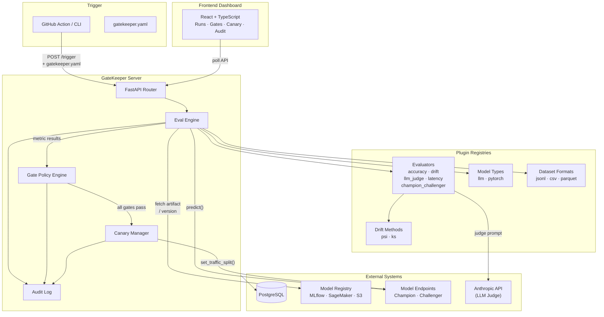
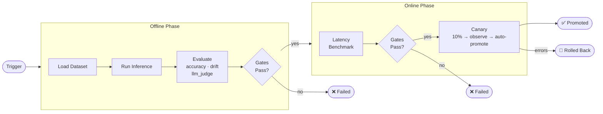

# GateKeeper

[](https://github.com/achyuthsamudrala/gatekeeper/actions/workflows/ci.yml)

Eval-gated model deployment pipeline. Sits between "model artifact exists" and "model serving production traffic" — runs quality gates, latency benchmarks, and canary traffic management before promoting a model to production.

## How It Works



### Pipeline Flow



**Two optional, composable phases:**

- **Offline** — Quality gates against eval datasets (accuracy, drift, LLM judge, champion vs challenger)
- **Online** — Latency benchmarks against live endpoints, then canary traffic with auto-promote/rollback

## Quickstart

See the full [Getting Started guide](docs/getting-started.md) for a complete walkthrough.

```bash
# Clone and start services
git clone https://github.com/achyuthsamudrala/gatekeeper.git
cd gatekeeper

# Backend
cd backend && pip install -e ".[test]" && cd ..

# Run tests
cd backend && pytest tests/ -v --asyncio-mode=auto

# Docker (full stack)
docker compose up -d
make migrate
make health
```

## Workflow Patterns

| Pattern | Phase | Example |
|---------|-------|---------|
| **A** — Offline only | `offline` | Quality validation before deployment |
| **B** — Online only | `online` | Latency + canary for pre-deployed models |
| **C** — Chained | `both` | Offline gates → online latency → canary |
| **D** — Custom evaluator | `offline` | Extend with your own evaluation logic |

Run demos: `make demo-a`, `make demo-b`, `make demo-c`, `make demo-plugin`

## Built-in Evaluators

| Evaluator | Phase | Metric | Description |
|-----------|-------|--------|-------------|
| `accuracy` | offline | `f1_weighted` | Classification metrics via sklearn |
| `drift` | offline | `max_psi_score` | Data drift (PSI, KS test) vs reference data |
| `llm_judge` | offline | `llm_judge_score` | LLM-as-judge quality scoring (Anthropic API) |
| `champion_challenger` | offline | `champion_challenger_delta` | Compare candidate vs current champion |
| `latency` | offline | `p95_latency_ms` | P50/P95/P99 latency benchmarking |

## Plugin System

Extend GateKeeper with custom evaluators, model types, dataset formats, drift methods, and more via Python entry points:

```toml
# pyproject.toml
[project.entry-points."gatekeeper.evaluators"]
my_eval = "my_package.evaluators:MyEvaluator"
```

See `examples/pattern-d-custom-evaluator/` and `docs/plugins.md`.

## Configuration

**`gatekeeper.yaml`** — Per-model config defining gates, thresholds, and canary settings. Lives in your model repo.

```yaml
version: "1.0"
model_type: llm
eval_dataset:
  uri: s3://bucket/eval-data.jsonl
  format: jsonl
  label_column: label
  task_type: classification
gates:
  - name: accuracy_gate
    phase: offline
    evaluator: accuracy
    metric: f1_weighted
    threshold: 0.85
    comparator: ">="
    blocking: true
```

**`server.yaml`** — Server-level config for adapters, serving endpoints, and LLM judge settings. See `docs/server-yaml.md`.

## GitHub Action

```yaml
- uses: your-org/gatekeeper/action@main
  with:
    gatekeeper_url: ${{ secrets.GATEKEEPER_URL }}
    gatekeeper_secret: ${{ secrets.GATEKEEPER_SECRET }}
    model_name: my-model
    phase: offline
    gatekeeper_yaml: ./gatekeeper.yaml
```

## API

| Method | Path | Description |
|--------|------|-------------|
| `GET` | `/health` | Health + adapter status |
| `POST` | `/api/v1/pipeline/trigger` | Trigger eval pipeline |
| `GET` | `/api/v1/pipeline/runs` | List runs |
| `GET` | `/api/v1/pipeline/runs/{id}` | Run detail |
| `GET` | `/api/v1/pipeline/runs/{id}/report` | Gate policy results |
| `GET` | `/api/v1/pipeline/runs/{id}/canary` | Canary snapshots |
| `GET` | `/api/v1/pipeline/runs/{id}/audit` | Audit log |
| `POST` | `/api/v1/pipeline/runs/{id}/promote` | Manual promote |
| `POST` | `/api/v1/pipeline/runs/{id}/rollback` | Manual rollback |
| `GET` | `/api/v1/system/registries` | Registered plugins |

## Architecture

- **Python 3.11** — Fully async (asyncio, FastAPI, asyncpg, httpx)
- **PostgreSQL 15** — Async via asyncpg driver
- **React 18 + TypeScript** — Strict mode, Vite, Tailwind CSS
- **6 plugin registries** — Evaluators, model types, dataset formats, drift methods, inference encodings, judge modalities
- **6 adapter types** — Registry (MLflow, SageMaker, S3, local) + Serving (OpenAI-compatible, TorchServe, custom HTTP, proxy)

## Docs

**Start here:**
- [Getting Started](docs/getting-started.md) — Clone to first pipeline run in 5 minutes
- [UI Guide](docs/ui.md) — Dashboard pages, status badges, actions
- [How It Works](docs/how-it-works.md) — Phase model, workflow patterns, pipeline lifecycle

**Configuration:**
- [gatekeeper.yaml Reference](docs/gatekeeper-yaml.md) — Per-model gate config
- [server.yaml Reference](docs/server-yaml.md) — Server-level adapter and auth config

**Operations:**
- [Deployment Guide](docs/deployment.md) — Production setup, scaling, env vars, troubleshooting
- [GitHub Action](docs/github-action.md) — CI/CD integration with bash + curl + jq

**Extending:**
- [Extending GateKeeper](docs/plugins.md) — All 6 plugin types, base class specs, data type schemas, adapter contracts
- [Async Architecture](docs/async-architecture.md) — The 8 async rules with correct/wrong code examples
- [Adapters](docs/adapters.md) — Registry and serving adapter types

## License

MIT
